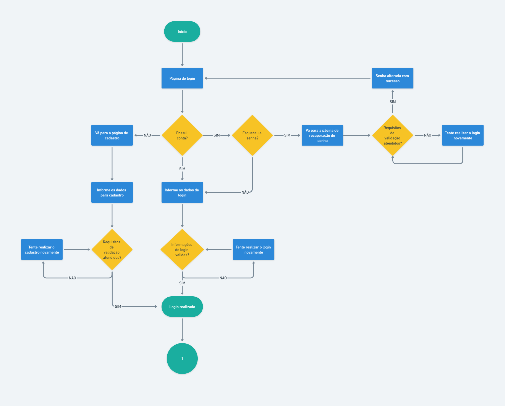
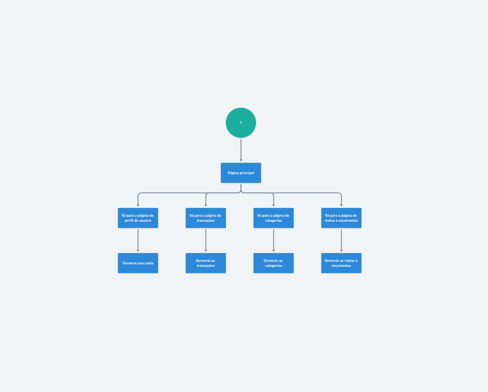

# Projeto de Interface

Estamos dando foco a diversas questões durante a criação da interface do sistema, incluindo agilidade, acessibilidade e usabilidade. Esses aspectos estão sendo cuidadosamente considerados para garantir que o projeto tenha uma identidade visual consistente em todas as telas, tanto para desktops quanto para dispositivos móveis.

## Diagrama de Fluxo

O Diagrama de Fluxo apresenta um modelo que ilustra como o usuário pode navegar pelo sistema por meio das telas, seguindo o planejamento da aplicação, em conformidade com os requisitos funcionais, não funcionais, restrições e histórias das personas.

|  |
| :---------------------------------------------------------------------------------------: |
|                      *Figura 1 - Primeira parte do fluxo do usuário*                      |

|  |
| :-------------------------------------------------------------------------------------: |
|                      *Figura 2 - Última parte do fluxo do usuário*                      |

## Wireframes

São protótipos usados em design de interface para sugerir a estrutura de um site web e seu relacionamentos entre suas páginas. Um wireframe web é uma ilustração semelhante do layout de elementos fundamentais na interface.
 
> **Links Úteis**:
> - [Protótipos vs Wireframes](https://www.nngroup.com/videos/prototypes-vs-wireframes-ux-projects/)
> - [Ferramentas de Wireframes](https://rockcontent.com/blog/wireframes/)
> - [MarvelApp](https://marvelapp.com/developers/documentation/tutorials/)
> - [Figma](https://www.figma.com/)
> - [Adobe XD](https://www.adobe.com/br/products/xd.html#scroll)
> - [Axure](https://www.axure.com/edu) (Licença Educacional)
> - [InvisionApp](https://www.invisionapp.com/) (Licença Educacional)
