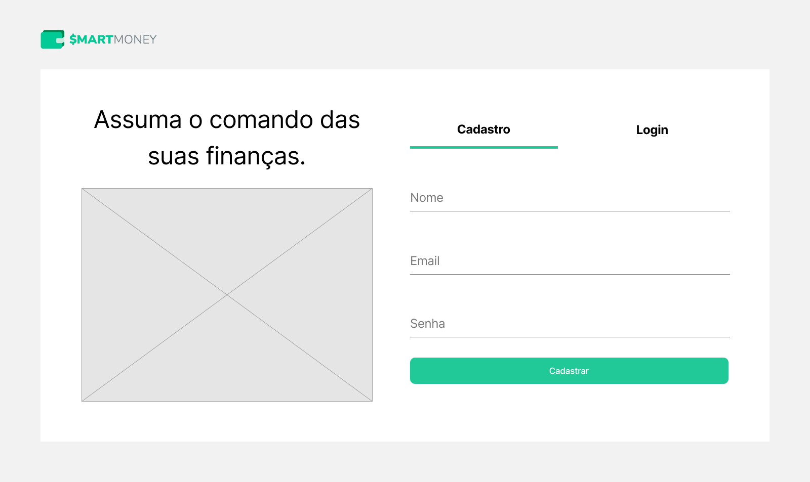
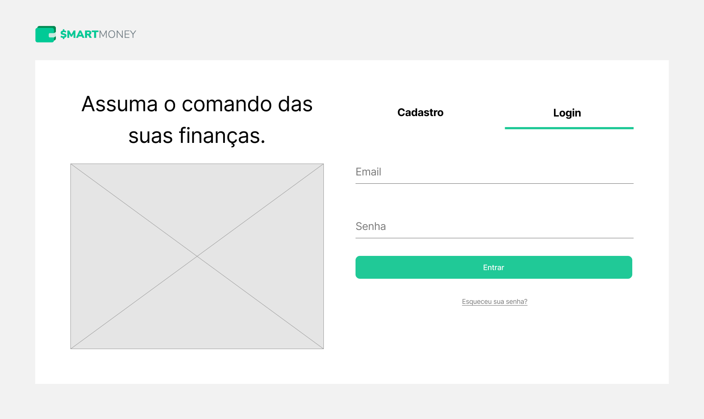

# Programação de Funcionalidades

<!-- Pré-requisitos: <a href="2-Especificação do Projeto.md"> Especificação do Projeto</a>, <a href="3-Projeto de Interface.md"> Projeto de Interface</a>, <a href="4-Metodologia.md"> Metodologia</a>, <a href="3-Projeto de Interface.md"> Projeto de Interface</a>, <a href="5-Arquitetura da Solução.md"> Arquitetura da Solução</a> -->

<!-- Implementação do sistema descrita por meio dos requisitos funcionais e/ou não funcionais. Deve relacionar os requisitos atendidos com os artefatos criados (código fonte), deverão apresentadas as instruções para acesso e verificação da implementação que deve estar funcional no ambiente de hospedagem.

Por exemplo: a tabela a seguir deverá ser preenchida considerando os artefatos desenvolvidos. -->

Nesta seção são apresentadas as telas desenvolvidas para cada uma das funcionalidades 
do sistema. <!--  O respectivo endereço (URL) e outras orientações de acesso são são -->
<!-- apresentadas na sequência. -->

## Página de Cadastro do Usuário (RF-001)

A página de cadastro do usuário apresenta a funcionalidade do usuário criar uma conta na aplicação.

|ID    | Descrição do Requisito  | Artefato(s) produzido(s) |
|------|-----------------------------------------|----|
|RF-001| Permitir que o usuário crie sua conta. | Models/Usuario.cs / Controllers/UsuariosController.cs / Views/Usuarios/Create.cshtml | 

|  |
| :---------------------------------------------------------------------------------------: |
|                                     *Página de cadastro do usuário*                      |

## Página de Login (RF-001)

A página de Login apresenta a funcionalidade do usuário acessar sua conta.

|ID    | Descrição do Requisito  | Artefato(s) produzido(s) |
|------|-----------------------------------------|----|
|RF-001| Permitir que o usuário faça Login. | Models/Usuario.cs / Controllers/UsuariosController.cs / Views/Usuarios/Login.cshtml | 

|  |
| :---------------------------------------------------------------------------------------: |
|                                     *Página de Login*                      |

<!-- # Instruções de acesso

Não deixe de informar o link onde a aplicação estiver disponível para acesso (por exemplo: https://adota-pet.herokuapp.com/src/index.html).

Se houver usuário de teste, o login e a senha também deverão ser informados aqui (por exemplo: usuário - admin / senha - admin).

O link e o usuário/senha descritos acima são apenas exemplos de como tais informações deverão ser apresentadas.

> **Links Úteis**:
>
> - [Trabalhando com HTML5 Local Storage e JSON](https://www.devmedia.com.br/trabalhando-com-html5-local-storage-e-json/29045)
> - [JSON Tutorial](https://www.w3resource.com/JSON)
> - [JSON Data Set Sample](https://opensource.adobe.com/Spry/samples/data_region/JSONDataSetSample.html)
> - [JSON - Introduction (W3Schools)](https://www.w3schools.com/js/js_json_intro.asp)
> - [JSON Tutorial (TutorialsPoint)](https://www.tutorialspoint.com/json/index.htm) -->
